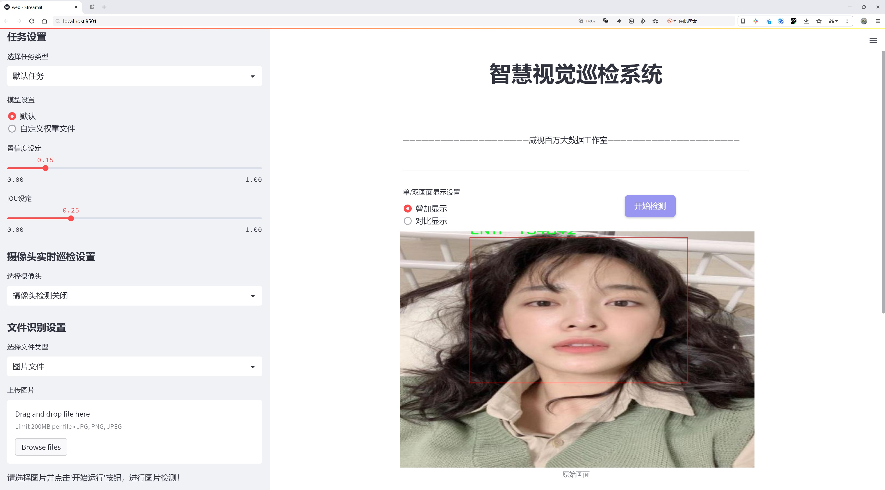
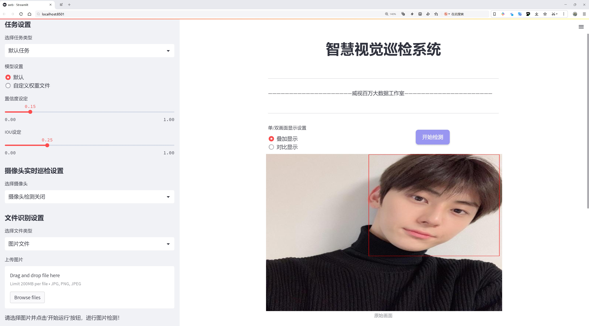
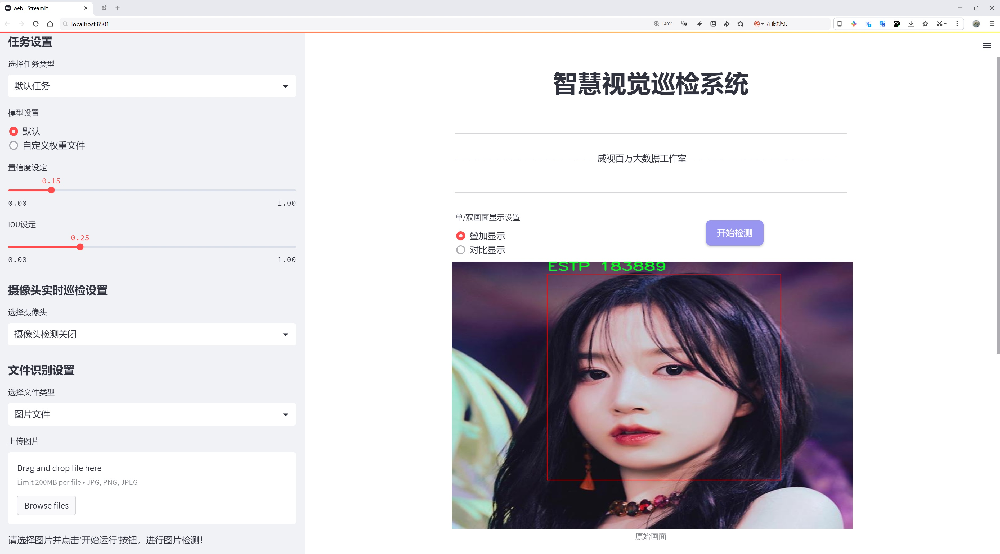
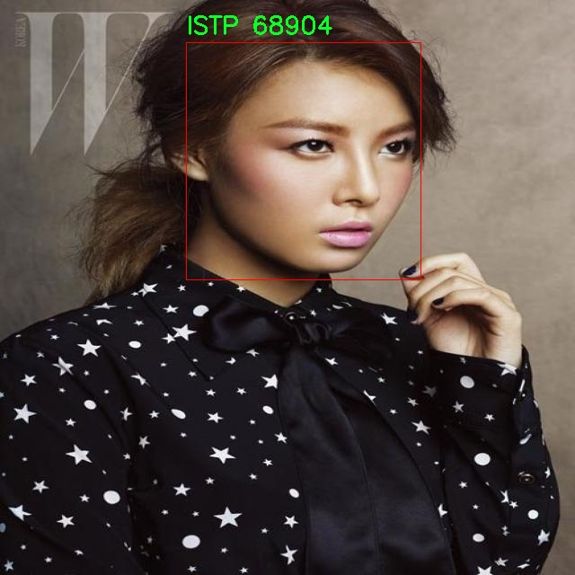
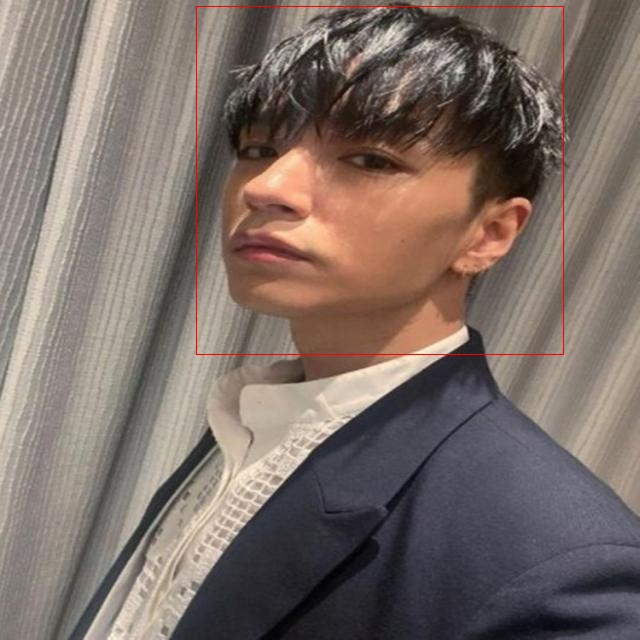

# 性格类型识别检测系统源码分享
 # [一条龙教学YOLOV8标注好的数据集一键训练_70+全套改进创新点发刊_Web前端展示]

### 1.研究背景与意义

项目参考[AAAI Association for the Advancement of Artificial Intelligence](https://gitee.com/qunshansj/projects)

项目来源[AACV Association for the Advancement of Computer Vision](https://gitee.com/qunmasj/projects)

研究背景与意义

在当今社会，个体的性格类型不仅影响着个人的生活方式、职业选择和人际关系，还在团队合作、领导力发展及心理健康等多个领域发挥着重要作用。随着心理学研究的深入，性格类型理论逐渐成为理解个体差异的重要工具。其中，迈尔斯-布里格斯性格类型指标（MBTI）因其简便易用和广泛适用而受到广泛关注。MBTI将人类性格划分为16种类型，涵盖了从外向到内向、直觉到感觉、思考到情感、判断到知觉等多个维度。这一理论不仅在心理学领域有着深远的影响，也在教育、职业规划和人力资源管理等领域得到了广泛应用。

然而，传统的性格类型识别方法往往依赖于问卷调查和自我报告，这种方法不仅耗时耗力，而且受限于个体的自我认知和表达能力，可能导致结果的偏差。随着计算机视觉和深度学习技术的快速发展，基于图像的性格类型识别系统逐渐成为一种新兴的研究方向。通过分析个体的面部表情、姿态和行为特征，利用先进的深度学习模型进行性格类型的自动识别，能够大幅提高识别的准确性和效率。

本研究旨在基于改进的YOLOv8模型，构建一个高效的性格类型识别系统。YOLO（You Only Look Once）系列模型以其快速的检测速度和较高的准确率在目标检测领域取得了显著成就。YOLOv8作为最新版本，进一步提升了模型的性能和适应性，为性格类型识别提供了强有力的技术支持。通过对2300张标注图像的训练，该系统将能够识别出16种不同的性格类型，包括ENFJ、ENFP、ENTJ、ENTP等，涵盖了MBTI理论中的所有类别。

本研究的意义在于，不仅为性格类型的自动识别提供了一种新的技术路径，还将推动心理学与计算机科学的交叉融合。通过引入深度学习技术，能够在大规模数据集上进行高效的性格类型分析，为个体提供更为精准的性格评估。同时，该系统的应用前景广泛，能够为教育机构、企业人力资源管理、心理咨询等领域提供数据支持，帮助人们更好地理解自我与他人，促进人际关系的和谐发展。

此外，本研究还将为未来的性格类型研究提供新的思路和方法。通过对YOLOv8模型的改进与优化，探索其在性格识别中的应用潜力，将为相关领域的研究者提供宝贵的经验和参考。综上所述，基于改进YOLOv8的性格类型识别系统不仅具有重要的理论价值，也具有广泛的实际应用意义，为推动心理学和人工智能的深度融合开辟了新的方向。

### 2.图片演示







##### 注意：由于此博客编辑较早，上面“2.图片演示”和“3.视频演示”展示的系统图片或者视频可能为老版本，新版本在老版本的基础上升级如下：（实际效果以升级的新版本为准）

  （1）适配了YOLOV8的“目标检测”模型和“实例分割”模型，通过加载相应的权重（.pt）文件即可自适应加载模型。

  （2）支持“图片识别”、“视频识别”、“摄像头实时识别”三种识别模式。

  （3）支持“图片识别”、“视频识别”、“摄像头实时识别”三种识别结果保存导出，解决手动导出（容易卡顿出现爆内存）存在的问题，识别完自动保存结果并导出到tempDir中。

  （4）支持Web前端系统中的标题、背景图等自定义修改，后面提供修改教程。

  另外本项目提供训练的数据集和训练教程,暂不提供权重文件（best.pt）,需要您按照教程进行训练后实现图片演示和Web前端界面演示的效果。

### 3.视频演示

[3.1 视频演示](https://www.bilibili.com/video/BV1QNtReKEvk/)

### 4.数据集信息展示

##### 4.1 本项目数据集详细数据（类别数＆类别名）

nc: 16
names: ['ENFJ', 'ENFP', 'ENTJ', 'ENTP', 'ESFJ', 'ESFP', 'ESTJ', 'ESTP', 'INFJ', 'INFP', 'INTJ', 'INTP', 'ISFJ', 'ISFP', 'ISTJ', 'ISTP']


##### 4.2 本项目数据集信息介绍

数据集信息展示

在本研究中，我们采用了名为“mbti”的数据集，以支持对性格类型的识别系统进行改进，特别是针对YOLOv8模型的训练和优化。该数据集专注于基于迈尔斯-布里格斯性格类型指标（MBTI）进行性格分类，涵盖了16种不同的性格类型。每种性格类型都有其独特的特征和行为模式，这使得数据集在心理学和个体差异研究中具有重要的应用价值。

“mbti”数据集的类别数量为16，具体包括：ENFJ、ENFP、ENTJ、ENTP、ESFJ、ESFP、ESTJ、ESTP、INFJ、INFP、INTJ、INTP、ISFJ、ISFP、ISTJ和ISTP。这些类别代表了不同的性格特征，涵盖了外向与内向、直觉与感觉、思考与情感、判断与知觉等维度。通过对这些性格类型的分析，研究者可以深入理解个体在社交、工作和学习等多方面的表现和倾向。

在数据集的构建过程中，数据来源多样，可能包括问卷调查、社交媒体分析、心理测试等。这些数据的多样性和丰富性为模型的训练提供了坚实的基础。每个性格类型的样本数量相对均衡，确保了模型在训练过程中不会偏向某一特定类型，从而提高了识别的准确性和可靠性。此外，数据集中的样本不仅包括文本数据，还可能包含图像、音频等多模态信息，为模型的多样化学习提供了更多的可能性。

为了有效地利用“mbti”数据集进行YOLOv8模型的训练，我们需要对数据进行预处理，包括数据清洗、特征提取和标签编码等步骤。这些步骤将有助于提高模型的学习效率和识别精度。在特征提取阶段，我们将重点关注与性格类型相关的关键特征，例如情感表达、社交互动模式、决策风格等。这些特征不仅可以帮助模型更好地理解不同性格类型的特点，还能在实际应用中为个体提供个性化的建议和指导。

在模型训练过程中，我们将采用多种评估指标来监测模型的性能，包括准确率、召回率和F1-score等。这些指标将帮助我们不断优化模型参数，以达到最佳的识别效果。同时，我们还将进行交叉验证，以确保模型在不同数据集上的泛化能力，从而提高其在实际应用中的可靠性。

综上所述，“mbti”数据集为我们改进YOLOv8的性格类型识别系统提供了丰富的资源和数据支持。通过对这一数据集的深入分析和有效利用，我们期望能够构建出一个高效、准确的性格识别模型，为心理学研究和个体发展提供新的视角和工具。未来的研究将继续探索如何结合最新的深度学习技术，进一步提升模型的性能和应用范围。








### 5.全套项目环境部署视频教程（零基础手把手教学）

[5.1 环境部署教程链接（零基础手把手教学）](https://www.ixigua.com/7404473917358506534?logTag=c807d0cbc21c0ef59de5)


[5.2 安装Python虚拟环境创建和依赖库安装视频教程链接（零基础手把手教学）](https://www.ixigua.com/7404474678003106304?logTag=1f1041108cd1f708b01a)

### 6.手把手YOLOV8训练视频教程（零基础小白有手就能学会）

[6.1 手把手YOLOV8训练视频教程（零基础小白有手就能学会）](https://www.ixigua.com/7404477157818401292?logTag=d31a2dfd1983c9668658)

### 7.70+种全套YOLOV8创新点代码加载调参视频教程（一键加载写好的改进模型的配置文件）

[7.1 70+种全套YOLOV8创新点代码加载调参视频教程（一键加载写好的改进模型的配置文件）](https://www.ixigua.com/7404478314661806627?logTag=29066f8288e3f4eea3a4)

### 8.70+种全套YOLOV8创新点原理讲解（非科班也可以轻松写刊发刊，V10版本正在科研待更新）

由于篇幅限制，每个创新点的具体原理讲解就不一一展开，具体见下列网址中的创新点对应子项目的技术原理博客网址【Blog】：


[8.1 70+种全套YOLOV8创新点原理讲解链接](https://gitee.com/qunmasj/good)

### 9.系统功能展示（检测对象为举例，实际内容以本项目数据集为准）

图9.1.系统支持检测结果表格显示

  图9.2.系统支持置信度和IOU阈值手动调节

  图9.3.系统支持自定义加载权重文件best.pt(需要你通过步骤5中训练获得)

  图9.4.系统支持摄像头实时识别

  图9.5.系统支持图片识别

  图9.6.系统支持视频识别

  图9.7.系统支持识别结果文件自动保存

  图9.8.系统支持Excel导出检测结果数据


### 10.原始YOLOV8算法原理

原始YOLOv8算法原理

YOLOv8作为YOLO系列的最新版本，继承并扩展了前几代模型的优点，展现出在目标检测领域的卓越性能。其设计理念是追求速度与精度的完美平衡，旨在满足实时应用的需求。YOLOv8的架构由输入端、骨干网络、颈部网络和头部网络四个主要部分组成，每个部分都经过精心设计，以提升模型的整体性能。

在输入端，YOLOv8采用了马赛克数据增强技术和自适应锚框计算。这种数据增强方法通过将四张不同的图像随机缩放并拼接成一张新图像，迫使模型学习到更丰富的特征和背景信息，从而提高了模型的泛化能力。此外，YOLOv8还引入了自适应灰度填充，以减少图像处理过程中的信息冗余，进一步优化了输入数据的质量。这种灵活的输入处理方式使得YOLOv8能够在不同长宽比的图像上进行有效的目标检测，提升了模型在实际应用中的适应性。

YOLOv8的骨干网络采用了C2f结构，取代了YOLOv5中的C3模块。C2f模块通过并行化多个梯度流分支，显著增强了特征提取的能力。这种设计灵感来源于YOLOv7的ELAN结构，旨在通过更丰富的梯度流来提升模型的特征表示能力。C2f模块不仅保留了轻量化的优势，还通过跨层连接提升了特征的传递效率，使得模型在面对复杂场景时能够更好地捕捉目标信息。

颈部网络则采用了路径聚合网络（PAN）结构，这一设计旨在增强不同尺度特征的融合能力。通过有效地整合来自不同层次的特征，YOLOv8能够更准确地识别和定位各种尺寸的目标物体。这种特征融合的策略在处理多尺度目标时表现尤为突出，确保了模型在各种场景下的稳定性和准确性。

在头部网络方面，YOLOv8实现了分类和检测过程的解耦。这一创新设计使得模型在进行目标检测时，能够独立处理分类和回归任务，从而提高了检测的精度和效率。具体而言，YOLOv8采用了Task-Aligned Assigner策略来优化正负样本的分配，确保模型在训练过程中能够聚焦于更具代表性的样本。此外，YOLOv8在损失计算方面结合了二元交叉熵损失（BCELoss）和分布焦点损失（DFLoss），以提升边界框预测的准确性。这种多元化的损失函数设计，使得模型在处理复杂场景时能够更快地收敛，提升了训练效率。

YOLOv8的另一大亮点在于其放弃了传统的锚框检测方法，转而采用无锚框（Anchor-Free）检测策略。这一转变使得模型在目标检测时不再依赖于预设的锚框，从而简化了模型结构，减少了计算复杂度。无锚框方法将目标检测转化为关键点检测，使得模型在面对不同尺寸和形状的目标时具备更强的灵活性和适应性。这种创新的检测方式，不仅提升了模型的泛化能力，还使得YOLOv8在实际应用中能够更快速地响应各种场景变化。

综上所述，YOLOv8通过对输入端、骨干网络、颈部网络和头部网络的全面优化，展现出在目标检测领域的强大实力。其创新的设计理念和高效的算法结构，使得YOLOv8在实时检测任务中成为了一个理想的选择。无论是在复杂的自然场景中，还是在工业应用中，YOLOv8都能够提供快速、准确的目标检测解决方案，为各类应用场景带来了新的可能性。随着YOLOv8的不断发展和应用，其在目标检测领域的影响力将持续扩大，推动相关技术的进步与创新。


### 11.项目核心源码讲解（再也不用担心看不懂代码逻辑）

#### 11.1 70+种YOLOv8算法改进源码大全和调试加载训练教程（非必要）\ultralytics\models\yolo\detect\__init__.py

下面是对给定代码的核心部分进行提炼和详细注释的结果：

```python
# Ultralytics YOLO 🚀, AGPL-3.0 license

# 从当前包中导入三个主要的类，用于目标检测的不同阶段
from .predict import DetectionPredictor  # 导入目标检测预测器
from .train import DetectionTrainer      # 导入目标检测训练器
from .val import DetectionValidator       # 导入目标检测验证器

# 定义模块的公开接口，指定哪些类可以被外部访问
__all__ = 'DetectionPredictor', 'DetectionTrainer', 'DetectionValidator'
```

### 代码分析与注释：

1. **模块说明**：
   - 该代码片段是一个Python模块的开头部分，涉及到Ultralytics YOLO（You Only Look Once）目标检测框架。它使用AGPL-3.0许可证。

2. **导入部分**：
   - `from .predict import DetectionPredictor`：从当前包中导入`DetectionPredictor`类，该类负责进行目标检测的预测工作。
   - `from .train import DetectionTrainer`：从当前包中导入`DetectionTrainer`类，该类用于训练目标检测模型。
   - `from .val import DetectionValidator`：从当前包中导入`DetectionValidator`类，该类用于验证目标检测模型的性能。

3. **公开接口**：
   - `__all__`变量定义了模块的公开接口，只有在使用`from module import *`时，列出的类才会被导入。这有助于控制模块的命名空间，避免不必要的名称冲突。

### 核心功能：
- 该模块的核心功能是提供目标检测的预测、训练和验证的工具类，构成了YOLO目标检测系统的基础部分。

这个文件是Ultralytics YOLO项目中的一个初始化文件，通常用于定义模块的公共接口。在这个文件中，首先以注释的形式标明了该项目的名称和许可证类型（AGPL-3.0）。接下来，文件导入了三个类：`DetectionPredictor`、`DetectionTrainer`和`DetectionValidator`，这些类分别用于目标检测的预测、训练和验证。

通过`__all__`变量，文件明确了当使用`from module import *`语句时，哪些名称会被导入。这种做法有助于控制模块的公共接口，确保用户只访问到那些经过设计的、可以公开使用的功能。

总的来说，这个文件的主要作用是将目标检测相关的功能模块组织在一起，并提供一个清晰的接口供其他部分调用。

#### 11.2 70+种YOLOv8算法改进源码大全和调试加载训练教程（非必要）\ultralytics\hub\auth.py

以下是代码中最核心的部分，并附上详细的中文注释：

```python
import requests

class Auth:
    """
    处理身份验证过程，包括API密钥处理、基于cookie的身份验证和头部生成。

    支持不同的身份验证方法：
    1. 直接使用API密钥。
    2. 使用浏览器cookie进行身份验证（特别是在Google Colab中）。
    3. 提示用户输入API密钥。
    """
    id_token = api_key = model_key = False  # 初始化身份验证相关的属性

    def __init__(self, api_key='', verbose=False):
        """
        初始化Auth类，可以选择性地传入API密钥。

        参数:
            api_key (str, optional): API密钥或组合的API密钥和模型ID
        """
        # 如果传入的API密钥包含模型ID，则只保留API密钥部分
        api_key = api_key.split('_')[0]

        # 设置API密钥属性，如果没有传入则使用设置中的API密钥
        self.api_key = api_key or SETTINGS.get('api_key', '')

        # 如果提供了API密钥
        if self.api_key:
            # 检查提供的API密钥是否与设置中的API密钥匹配
            if self.api_key == SETTINGS.get('api_key'):
                if verbose:
                    LOGGER.info(f'{PREFIX}Authenticated ✅')  # 记录已登录信息
                return
            else:
                # 尝试使用提供的API密钥进行身份验证
                success = self.authenticate()
        # 如果没有提供API密钥且当前环境是Google Colab
        elif is_colab():
            # 尝试使用浏览器cookie进行身份验证
            success = self.auth_with_cookies()
        else:
            # 请求用户输入API密钥
            success = self.request_api_key()

        # 如果身份验证成功，更新设置中的API密钥
        if success:
            SETTINGS.update({'api_key': self.api_key})
            if verbose:
                LOGGER.info(f'{PREFIX}New authentication successful ✅')  # 记录新登录成功信息
        elif verbose:
            LOGGER.info(f'{PREFIX}Retrieve API key from {API_KEY_URL}')  # 提示获取API密钥的链接

    def authenticate(self) -> bool:
        """
        尝试使用id_token或API密钥进行服务器身份验证。

        返回:
            bool: 如果身份验证成功返回True，否则返回False。
        """
        try:
            header = self.get_auth_header()  # 获取身份验证头部
            if header:
                r = requests.post(f'{HUB_API_ROOT}/v1/auth', headers=header)  # 发送身份验证请求
                if not r.json().get('success', False):
                    raise ConnectionError('Unable to authenticate.')  # 如果身份验证失败，抛出异常
                return True
            raise ConnectionError('User has not authenticated locally.')  # 如果没有本地身份验证信息
        except ConnectionError:
            self.id_token = self.api_key = False  # 重置无效的身份验证信息
            LOGGER.warning(f'{PREFIX}Invalid API key ⚠️')  # 记录无效API密钥的警告
            return False

    def get_auth_header(self):
        """
        获取用于API请求的身份验证头部。

        返回:
            (dict): 如果设置了id_token或API密钥，则返回身份验证头部，否则返回None。
        """
        if self.id_token:
            return {'authorization': f'Bearer {self.id_token}'}  # 使用id_token生成头部
        elif self.api_key:
            return {'x-api-key': self.api_key}  # 使用API密钥生成头部
        return None  # 如果没有身份验证信息，返回None
```

### 代码说明：
1. **Auth类**：负责管理身份验证过程，包括API密钥和cookie的处理。
2. **`__init__`方法**：初始化时可以传入API密钥，处理身份验证的逻辑。
3. **`authenticate`方法**：尝试使用API密钥或id_token进行身份验证，并返回结果。
4. **`get_auth_header`方法**：根据当前的身份验证状态生成相应的请求头部。

这个程序文件是用于管理Ultralytics YOLO（You Only Look Once）算法的身份验证过程，主要涉及API密钥的处理、基于cookie的身份验证以及请求头的生成。该类提供了多种身份验证方式，包括直接使用API密钥、使用浏览器cookie进行身份验证（特别是在Google Colab环境中），以及提示用户输入API密钥。

在类的属性中，`id_token`、`api_key`和`model_key`都初始化为`False`，用以存储身份验证所需的令牌和API密钥。构造函数`__init__`接受一个可选的API密钥参数，并根据传入的值或设置中的API密钥进行初始化。如果提供了API密钥，程序会检查该密钥是否与设置中的密钥匹配。如果匹配，程序会记录用户已登录的信息；如果不匹配，则尝试进行身份验证。如果没有提供API密钥且当前环境为Google Colab，程序会尝试使用浏览器cookie进行身份验证；否则，程序会请求用户输入API密钥。

`request_api_key`方法会提示用户输入API密钥，最多尝试三次。如果用户输入的密钥能够成功通过身份验证，程序将返回成功状态；否则，会抛出连接错误。`authenticate`方法则尝试使用`id_token`或API密钥与服务器进行身份验证，并返回是否成功的布尔值。如果身份验证失败，程序会重置无效的令牌，并记录警告信息。

`auth_with_cookies`方法专门用于在Google Colab环境中通过cookie进行身份验证。如果成功获取到身份验证信息，程序会设置`id_token`并调用`authenticate`方法进行验证。最后，`get_auth_header`方法用于生成API请求所需的身份验证头，如果`id_token`或`api_key`存在，则返回相应的头信息；否则返回`None`。

整体来看，这个文件的功能是确保用户能够安全地访问Ultralytics YOLO的API，通过不同的身份验证方式来提高用户体验和安全性。

#### 11.3 ui.py

以下是代码中最核心的部分，并附上详细的中文注释：

```python
import sys
import subprocess

def run_script(script_path):
    """
    使用当前 Python 环境运行指定的脚本。

    Args:
        script_path (str): 要运行的脚本路径

    Returns:
        None
    """
    # 获取当前 Python 解释器的路径
    python_path = sys.executable

    # 构建运行命令，使用 streamlit 运行指定的脚本
    command = f'"{python_path}" -m streamlit run "{script_path}"'

    # 执行命令
    result = subprocess.run(command, shell=True)
    # 检查命令执行的返回码，如果不为0则表示出错
    if result.returncode != 0:
        print("脚本运行出错。")

# 实例化并运行应用
if __name__ == "__main__":
    # 指定要运行的脚本路径
    script_path = "web.py"  # 这里可以替换为实际的脚本路径

    # 调用函数运行脚本
    run_script(script_path)
```

### 代码注释说明：
1. **导入模块**：
   - `sys`：用于访问与 Python 解释器相关的变量和函数。
   - `subprocess`：用于执行外部命令。

2. **定义 `run_script` 函数**：
   - 此函数接受一个参数 `script_path`，表示要运行的 Python 脚本的路径。
   - 使用 `sys.executable` 获取当前 Python 解释器的路径，以确保使用正确的 Python 环境。

3. **构建命令**：
   - 使用 f-string 格式化字符串构建命令，调用 `streamlit` 来运行指定的脚本。

4. **执行命令**：
   - 使用 `subprocess.run` 执行构建的命令，并将 `shell` 参数设置为 `True`，允许在 shell 中执行命令。
   - 检查命令的返回码，如果返回码不为0，表示脚本运行出错，打印错误信息。

5. **主程序入口**：
   - 在 `if __name__ == "__main__":` 块中，指定要运行的脚本路径，并调用 `run_script` 函数执行该脚本。

这个程序文件的主要功能是通过当前的 Python 环境来运行一个指定的脚本，具体是一个名为 `web.py` 的文件。程序首先导入了必要的模块，包括 `sys`、`os` 和 `subprocess`，这些模块提供了与系统交互的功能。

在程序中定义了一个名为 `run_script` 的函数，该函数接受一个参数 `script_path`，这个参数是要运行的脚本的路径。函数内部首先获取当前 Python 解释器的路径，使用 `sys.executable` 来实现。接着，构建一个命令字符串，命令的格式是通过 Python 解释器运行 `streamlit` 模块，并指定要运行的脚本路径。

然后，使用 `subprocess.run` 方法来执行这个命令。`shell=True` 参数表示在 shell 中执行命令。执行完命令后，程序会检查返回码，如果返回码不为 0，说明脚本运行出错，此时会打印出错误信息。

在文件的最后部分，使用 `if __name__ == "__main__":` 语句来确保只有在直接运行该文件时才会执行后面的代码。在这里，指定了要运行的脚本路径为 `web.py`，并调用 `run_script` 函数来执行这个脚本。

整体来看，这个程序的目的是为了方便地在当前 Python 环境中运行一个 Streamlit 应用，具体的应用逻辑则在 `web.py` 文件中实现。

#### 11.4 code\ultralytics\utils\tuner.py

以下是代码中最核心的部分，并附上详细的中文注释：

```python
import subprocess  # 用于执行系统命令

from ultralytics.cfg import TASK2DATA, TASK2METRIC, get_save_dir  # 导入配置相关的模块
from ultralytics.utils import DEFAULT_CFG, DEFAULT_CFG_DICT, LOGGER, NUM_THREADS  # 导入工具函数和常量

def run_ray_tune(
    model, space: dict = None, grace_period: int = 10, gpu_per_trial: int = None, max_samples: int = 10, **train_args
):
    """
    使用 Ray Tune 进行超参数调优。

    参数:
        model (YOLO): 要进行调优的模型。
        space (dict, optional): 超参数搜索空间。默认为 None。
        grace_period (int, optional): ASHA 调度器的宽限期（以 epoch 为单位）。默认为 10。
        gpu_per_trial (int, optional): 每个试验分配的 GPU 数量。默认为 None。
        max_samples (int, optional): 要运行的最大试验次数。默认为 10。
        train_args (dict, optional): 传递给 `train()` 方法的额外参数。默认为 {}。

    返回:
        (dict): 包含超参数搜索结果的字典。
    """

    # 日志记录 RayTune 的文档链接
    LOGGER.info("💡 Learn about RayTune at https://docs.ultralytics.com/integrations/ray-tune")
    
    # 如果没有提供 train_args，则初始化为空字典
    if train_args is None:
        train_args = {}

    # 尝试安装 Ray Tune
    try:
        subprocess.run("pip install ray[tune]".split(), check=True)  # 安装 Ray Tune

        import ray  # 导入 Ray 库
        from ray import tune  # 导入 Ray Tune
        from ray.air import RunConfig  # 导入运行配置
        from ray.air.integrations.wandb import WandbLoggerCallback  # 导入 Wandb 日志回调
        from ray.tune.schedulers import ASHAScheduler  # 导入 ASHA 调度器
    except ImportError:
        raise ModuleNotFoundError('调优超参数需要 Ray Tune。请使用: pip install "ray[tune]" 安装')

    # 尝试导入 wandb
    try:
        import wandb
        assert hasattr(wandb, "__version__")  # 确保 wandb 已正确安装
    except (ImportError, AssertionError):
        wandb = False  # 如果没有安装 wandb，则设置为 False

    # 定义默认的超参数搜索空间
    default_space = {
        "lr0": tune.uniform(1e-5, 1e-1),  # 初始学习率
        "lrf": tune.uniform(0.01, 1.0),  # 最终学习率
        "momentum": tune.uniform(0.6, 0.98),  # 动量
        "weight_decay": tune.uniform(0.0, 0.001),  # 权重衰减
        "warmup_epochs": tune.uniform(0.0, 5.0),  # 预热 epochs
        "box": tune.uniform(0.02, 0.2),  # 边框损失增益
        "cls": tune.uniform(0.2, 4.0),  # 分类损失增益
        # 其他数据增强参数...
    }

    # 将模型放入 Ray 存储中
    task = model.task  # 获取模型任务
    model_in_store = ray.put(model)  # 将模型放入 Ray 存储

    def _tune(config):
        """
        使用指定的超参数和额外参数训练 YOLO 模型。

        参数:
            config (dict): 用于训练的超参数字典。

        返回:
            None.
        """
        model_to_train = ray.get(model_in_store)  # 从 Ray 存储中获取模型
        model_to_train.reset_callbacks()  # 重置回调
        config.update(train_args)  # 更新配置
        results = model_to_train.train(**config)  # 训练模型
        return results.results_dict  # 返回结果字典

    # 获取搜索空间
    if not space:
        space = default_space  # 如果没有提供搜索空间，则使用默认空间
        LOGGER.warning("WARNING ⚠️ search space not provided, using default search space.")

    # 获取数据集
    data = train_args.get("data", TASK2DATA[task])  # 从参数中获取数据集
    space["data"] = data  # 将数据集添加到搜索空间
    if "data" not in train_args:
        LOGGER.warning(f'WARNING ⚠️ data not provided, using default "data={data}".')

    # 定义可训练的函数并分配资源
    trainable_with_resources = tune.with_resources(_tune, {"cpu": NUM_THREADS, "gpu": gpu_per_trial or 0})

    # 定义 ASHA 调度器进行超参数搜索
    asha_scheduler = ASHAScheduler(
        time_attr="epoch",  # 以 epoch 为单位
        metric=TASK2METRIC[task],  # 评估指标
        mode="max",  # 最大化指标
        max_t=train_args.get("epochs") or DEFAULT_CFG_DICT["epochs"] or 100,  # 最大训练 epochs
        grace_period=grace_period,  # 宽限期
        reduction_factor=3,  # 减少因子
    )

    # 定义超参数搜索的回调
    tuner_callbacks = [WandbLoggerCallback(project="YOLOv8-tune")] if wandb else []

    # 创建 Ray Tune 超参数搜索调优器
    tune_dir = get_save_dir(DEFAULT_CFG, name="tune").resolve()  # 获取保存目录
    tune_dir.mkdir(parents=True, exist_ok=True)  # 创建目录
    tuner = tune.Tuner(
        trainable_with_resources,
        param_space=space,
        tune_config=tune.TuneConfig(scheduler=asha_scheduler, num_samples=max_samples),  # 调优配置
        run_config=RunConfig(callbacks=tuner_callbacks, storage_path=tune_dir),  # 运行配置
    )

    # 运行超参数搜索
    tuner.fit()

    # 返回超参数搜索的结果
    return tuner.get_results()  # 获取并返回结果
```

以上代码是一个使用 Ray Tune 进行超参数调优的函数，核心部分包括超参数空间的定义、模型训练的封装、调度器的设置以及最终的调优过程。注释详细解释了每个部分的功能和目的。

这个程序文件是用于超参数调优的，主要依赖于Ray Tune库来优化YOLO模型的训练过程。首先，文件导入了一些必要的模块和配置，包括任务到数据集的映射、日志记录器、默认配置等。

`run_ray_tune`函数是这个文件的核心功能，它接受多个参数来配置超参数调优的过程。主要参数包括模型对象、超参数搜索空间、每个试验的GPU数量、最大样本数等。函数的目标是通过Ray Tune来优化YOLO模型的超参数，并返回一个包含搜索结果的字典。

在函数内部，首先会记录一条信息，提示用户可以查看Ray Tune的文档。接着，尝试安装Ray Tune库，如果安装失败，则抛出一个模块未找到的异常。随后，函数会尝试导入WandB库，用于记录实验结果。

接下来，定义了一个默认的超参数搜索空间，其中包括学习率、动量、权重衰减、数据增强参数等。这些参数的值范围是通过均匀分布或选择器来定义的。

然后，模型被放入Ray的存储中，以便在调优过程中可以方便地访问。定义了一个内部函数`_tune`，该函数负责使用给定的超参数训练YOLO模型，并返回训练结果。

函数接着检查是否提供了超参数搜索空间，如果没有，则使用默认的搜索空间。同时，它还会从训练参数中获取数据集信息，如果未提供数据集，则使用默认值。

在定义了训练函数后，设置了ASHA调度器，用于管理超参数搜索的过程。ASHA调度器会根据训练的进展动态调整超参数的选择，以提高搜索效率。

接下来，设置了用于记录实验的回调函数，如果WandB库可用，则使用WandB的记录器。然后，创建Ray Tune的超参数搜索器，并指定参数空间、调度器和回调函数。

最后，调用`tuner.fit()`开始超参数搜索，并返回搜索结果。这段代码的整体结构清晰，逻辑严谨，能够有效地进行YOLO模型的超参数调优。

#### 11.5 70+种YOLOv8算法改进源码大全和调试加载训练教程（非必要）\ultralytics\nn\modules\__init__.py

以下是保留的核心代码部分，并添加了详细的中文注释：

```python
# 导入所需的模块
from .block import *        # 导入自定义的块模块
from .conv import *         # 导入卷积层模块
from .head import *         # 导入模型头部模块
from .transformer import *   # 导入变换器模块
```

### 代码注释说明：

1. **模块导入**：
   - `from .block import *`：导入当前包中的 `block` 模块，通常包含一些基本的网络结构或功能块。
   - `from .conv import *`：导入卷积层相关的功能，卷积层是卷积神经网络（CNN）的核心组件。
   - `from .head import *`：导入模型的头部模块，通常负责输出层的定义，可能包括分类或回归的功能。
   - `from .transformer import *`：导入变换器模块，可能用于处理输入数据或实现某种特定的网络结构。

这些模块的组合构成了一个完整的深度学习模型，通常用于目标检测、图像分类等任务。

该程序文件是Ultralytics YOLO项目的一部分，主要用于定义和导入YOLOv8算法相关的模块。文件开头的注释部分说明了该文件的版权信息，遵循AGPL-3.0许可证，并简要介绍了Ultralytics模块的功能。

在示例代码中，首先从`ultralytics.nn.modules`导入所有模块，并使用PyTorch库创建一个张量`x`，其形状为(1, 128, 40, 40)，这通常表示一个批次中有1个样本，特征通道为128，空间维度为40x40。接着，实例化了一个卷积层`Conv`，输入和输出通道均为128。然后，生成一个文件名`f`，该文件名基于卷积层的名称，并将其扩展名设置为`.onnx`，表示将模型导出为ONNX格式。

最后，使用`torch.onnx.export`函数将卷积层模型导出为ONNX文件，并通过系统命令调用`onnxsim`对导出的ONNX文件进行优化，随后打开该文件。这段代码展示了如何将YOLOv8中的模块可视化，便于用户理解和调试模型结构。

文件的最后部分导入了多个模块，包括`block`、`conv`、`head`和`transformer`，这些模块可能包含了YOLOv8模型的不同组件和功能，便于在其他地方使用和扩展。整体来看，该文件为YOLOv8的实现提供了基础模块的组织和导入方式。

#### 11.6 train.py

以下是经过简化和注释的核心代码部分：

```python
import random
import numpy as np
import torch.nn as nn
from ultralytics.data import build_dataloader, build_yolo_dataset
from ultralytics.engine.trainer import BaseTrainer
from ultralytics.models import yolo
from ultralytics.nn.tasks import DetectionModel
from ultralytics.utils import LOGGER, RANK
from ultralytics.utils.torch_utils import de_parallel, torch_distributed_zero_first

class DetectionTrainer(BaseTrainer):
    """
    DetectionTrainer类，继承自BaseTrainer，用于基于检测模型的训练。
    """

    def build_dataset(self, img_path, mode="train", batch=None):
        """
        构建YOLO数据集。

        参数:
            img_path (str): 包含图像的文件夹路径。
            mode (str): 模式，可以是'train'或'val'，用于自定义不同的增强。
            batch (int, optional): 批次大小，适用于'rect'模式。默认为None。
        """
        gs = max(int(de_parallel(self.model).stride.max() if self.model else 0), 32)
        return build_yolo_dataset(self.args, img_path, batch, self.data, mode=mode, rect=mode == "val", stride=gs)

    def get_dataloader(self, dataset_path, batch_size=16, rank=0, mode="train"):
        """构建并返回数据加载器。"""
        assert mode in ["train", "val"]
        with torch_distributed_zero_first(rank):  # 仅在DDP时初始化数据集*.cache一次
            dataset = self.build_dataset(dataset_path, mode, batch_size)
        shuffle = mode == "train"  # 训练模式下打乱数据
        workers = self.args.workers if mode == "train" else self.args.workers * 2
        return build_dataloader(dataset, batch_size, workers, shuffle, rank)  # 返回数据加载器

    def preprocess_batch(self, batch):
        """对图像批次进行预处理，包括缩放和转换为浮点数。"""
        batch["img"] = batch["img"].to(self.device, non_blocking=True).float() / 255  # 将图像转换为浮点数并归一化
        if self.args.multi_scale:  # 如果启用多尺度
            imgs = batch["img"]
            sz = (
                random.randrange(self.args.imgsz * 0.5, self.args.imgsz * 1.5 + self.stride)
                // self.stride
                * self.stride
            )  # 随机选择尺寸
            sf = sz / max(imgs.shape[2:])  # 计算缩放因子
            if sf != 1:
                ns = [
                    math.ceil(x * sf / self.stride) * self.stride for x in imgs.shape[2:]
                ]  # 计算新的形状
                imgs = nn.functional.interpolate(imgs, size=ns, mode="bilinear", align_corners=False)  # 进行插值
            batch["img"] = imgs
        return batch

    def set_model_attributes(self):
        """设置模型的属性，包括类别数量和名称。"""
        self.model.nc = self.data["nc"]  # 将类别数量附加到模型
        self.model.names = self.data["names"]  # 将类别名称附加到模型
        self.model.args = self.args  # 将超参数附加到模型

    def get_model(self, cfg=None, weights=None, verbose=True):
        """返回YOLO检测模型。"""
        model = DetectionModel(cfg, nc=self.data["nc"], verbose=verbose and RANK == -1)
        if weights:
            model.load(weights)  # 加载权重
        return model

    def plot_training_samples(self, batch, ni):
        """绘制带有注释的训练样本。"""
        plot_images(
            images=batch["img"],
            batch_idx=batch["batch_idx"],
            cls=batch["cls"].squeeze(-1),
            bboxes=batch["bboxes"],
            paths=batch["im_file"],
            fname=self.save_dir / f"train_batch{ni}.jpg",
            on_plot=self.on_plot,
        )

    def plot_metrics(self):
        """从CSV文件绘制指标。"""
        plot_results(file=self.csv, on_plot=self.on_plot)  # 保存结果图
```

### 代码说明：
1. **DetectionTrainer类**：这是一个用于训练YOLO检测模型的类，继承自`BaseTrainer`。
2. **build_dataset方法**：根据给定的图像路径和模式（训练或验证）构建YOLO数据集。
3. **get_dataloader方法**：构建并返回数据加载器，支持分布式训练。
4. **preprocess_batch方法**：对输入的图像批次进行预处理，包括归一化和可选的多尺度调整。
5. **set_model_attributes方法**：设置模型的类别数量和名称等属性。
6. **get_model方法**：返回一个YOLO检测模型实例，可以选择加载预训练权重。
7. **plot_training_samples方法**：绘制训练样本及其对应的注释。
8. **plot_metrics方法**：从CSV文件中绘制训练过程中的指标。

这个程序文件 `train.py` 是一个用于训练 YOLO（You Only Look Once）目标检测模型的实现，继承自 `BaseTrainer` 类。程序中包含了多个方法，用于构建数据集、获取数据加载器、预处理图像批次、设置模型属性、获取模型、进行验证、记录损失、输出训练进度、绘制训练样本和绘制训练指标等。

首先，`DetectionTrainer` 类的构造函数中，用户可以通过传入参数（如模型路径、数据集配置和训练轮数）来初始化训练器。该类的 `build_dataset` 方法用于构建 YOLO 数据集，接受图像路径、模式（训练或验证）和批次大小作为参数。它会根据模型的步幅计算合适的大小，并调用 `build_yolo_dataset` 函数来生成数据集。

`get_dataloader` 方法则负责构建数据加载器，确保在分布式训练时只初始化一次数据集，并根据模式决定是否打乱数据。该方法还会根据模式调整工作线程的数量。

在图像预处理方面，`preprocess_batch` 方法会将图像转换为浮点数并进行归一化处理。如果启用了多尺度训练，它还会随机调整图像的大小，以适应不同的输入尺寸。

`set_model_attributes` 方法用于设置模型的属性，包括类别数量和类别名称，以便模型能够正确处理数据集中的不同类别。

`get_model` 方法返回一个 YOLO 检测模型实例，并可以选择加载预训练权重。`get_validator` 方法则返回一个用于验证模型性能的验证器。

在损失记录方面，`label_loss_items` 方法会返回一个包含训练损失项的字典，便于后续的监控和分析。`progress_string` 方法则生成一个格式化的字符串，用于输出训练进度，包括当前轮次、GPU 内存使用情况、损失值、实例数量和图像大小等信息。

此外，程序还提供了绘制训练样本和训练指标的功能。`plot_training_samples` 方法会将当前批次的训练样本及其标注绘制出来，而 `plot_metrics` 方法则从 CSV 文件中读取指标并生成可视化结果。最后，`plot_training_labels` 方法会创建一个带有标注的训练图，展示数据集中所有的边界框和类别信息。

整体来看，这个文件实现了 YOLO 模型训练的各个环节，涵盖了数据处理、模型构建、训练监控和结果可视化等功能，适合用于目标检测任务的训练。

### 12.系统整体结构（节选）

### 整体功能和构架概括

该项目是一个基于YOLOv8的目标检测框架，提供了丰富的功能模块和工具，旨在支持模型的训练、验证、超参数调优和可视化。项目的结构清晰，各个模块之间相互独立又紧密关联，方便用户进行扩展和定制。

主要功能包括：
- **模型训练**：通过`train.py`文件实现YOLO模型的训练过程，支持数据集构建、数据加载、损失记录和训练进度监控。
- **身份验证**：`auth.py`负责处理用户的身份验证，确保用户能够安全地访问API。
- **超参数调优**：`tuner.py`使用Ray Tune库进行超参数优化，帮助用户找到最佳的模型配置。
- **模块导入**：`__init__.py`和其他模块文件负责导入和组织YOLOv8模型的各个组件，确保代码的可读性和可维护性。
- **可视化工具**：`plotting.py`和其他相关文件提供了可视化功能，帮助用户理解模型的训练过程和性能。
- **额外模块**：如`afpn.py`和`block.py`等文件实现了YOLOv8模型的特定功能和结构，支持模型的扩展和改进。

### 文件功能整理表

| 文件路径                                                                                               | 功能描述                                                         |
|--------------------------------------------------------------------------------------------------------|------------------------------------------------------------------|
| `ultralytics/models/yolo/detect/__init__.py`                                                         | 定义YOLO模型的公共接口，导入相关模块。                          |
| `ultralytics/hub/auth.py`                                                                             | 处理用户身份验证，支持API密钥和cookie验证。                     |
| `ui.py`                                                                                               | 运行Streamlit应用，提供用户界面。                               |
| `code/ultralytics/utils/tuner.py`                                                                     | 使用Ray Tune进行超参数调优，优化YOLO模型训练。                 |
| `ultralytics/nn/modules/__init__.py`                                                                 | 导入YOLOv8模型的各个模块，组织模型结构。                        |
| `train.py`                                                                                            | 实现YOLO模型的训练过程，包括数据集构建、损失记录和训练监控。   |
| `ultralytics/nn/extra_modules/afpn.py`                                                               | 实现自适应特征金字塔网络（AFPN），用于改进YOLO模型的特征提取。  |
| `code/ultralytics/models/utils/loss.py`                                                              | 定义YOLO模型的损失函数，计算训练过程中的损失值。                |
| `ultralytics/utils/plotting.py`                                                                       | 提供可视化工具，帮助用户理解训练过程和模型性能。                |
| `code/ultralytics/solutions/speed_estimation.py`                                                     | 实现速度估计功能，可能用于评估模型的推理速度。                  |
| `code/ultralytics/nn/modules/block.py`                                                                | 定义YOLO模型的基本构建块，支持模型的扩展和定制。                |
| `code/ultralytics/utils/dist.py`                                                                      | 提供分布式训练的工具和功能，支持多GPU训练。                     |
| `ultralytics/utils/callbacks/dvc.py`                                                                 | 实现与DVC（数据版本控制）集成的回调功能，支持模型管理和版本控制。 |

这个表格总结了每个文件的主要功能，帮助用户快速了解项目的结构和各个模块的作用。

注意：由于此博客编辑较早，上面“11.项目核心源码讲解（再也不用担心看不懂代码逻辑）”中部分代码可能会优化升级，仅供参考学习，完整“训练源码”、“Web前端界面”和“70+种创新点源码”以“13.完整训练+Web前端界面+70+种创新点源码、数据集获取”的内容为准。

### 13.完整训练+Web前端界面+70+种创新点源码、数据集获取


# [下载链接：https://mbd.pub/o/bread/ZpuXlJ1y](https://mbd.pub/o/bread/ZpuXlJ1y)